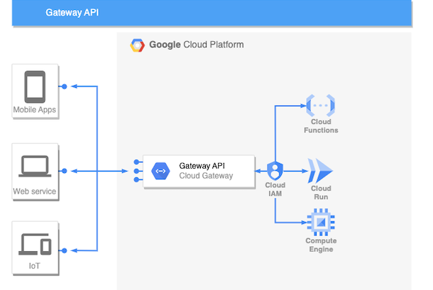

# API Gateway usage for serverless

## Usage
- Allows to decouple your frontend from backend, it can break the frontend requests into several services.
- It can help you to move your monolith backend into a microservices architecture.
- Centralize Authentication access for your API’s
- API monitoring, metrics, quotas, and analytics
- Centralize and manage API versioning

## Terraform example
Example with hello serverless Cloud Run and Api Gateway. Cloud Run secured via IAM, when Api Gateway is open to public internet.
Note: app must support Open Api (specification could be generated automatically via swagger)